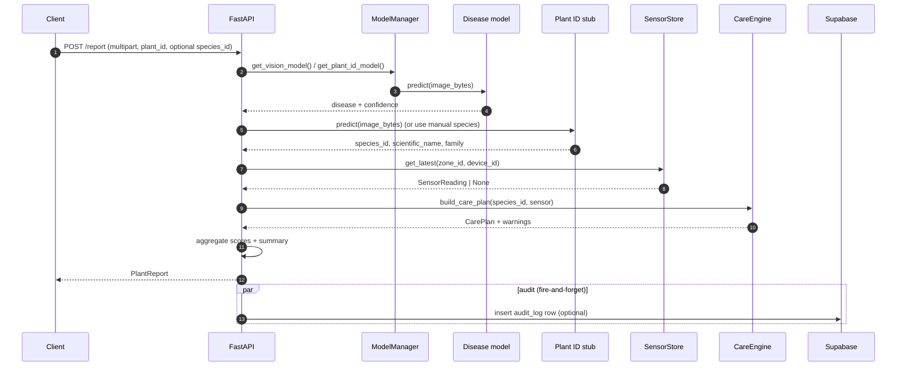

# PlantVision — Phase 3 Upgrade Notes

> Phase 3 layers production-grade reliability and a unified plant-care
> experience on top of the working Phase 2 stack (FastAPI → Supabase
> Cloud). Nothing in Phase 1 or Phase 2 was removed; every Phase 3 field
> is additive and the legacy contract continues to work for older
> clients.

---

## Architecture (after Phase 3)

```mermaid
flowchart LR
    subgraph Edge
        ESP32[ESP32 sensor node]
        Camera[Camera / Upload]
        UI[Frontend / mobile-app]
    end

    subgraph FastAPI
        Sensor[/POST /sensor/]
        Predict[/POST /predict/]
        Report[/POST /report/]
        Care[/GET /care/{plant_id}/]
        HSensor[/GET /health/sensor/]
        HAudit[/GET /health/audit/]
    end

    subgraph Services
        ModelMgr[ModelManager singleton]
        VisionM[Disease YOLO / Stub]
        PlantIdM[Plant ID Stub]
        Health[plant_health]
        CareEng[care_engine]
        ReportB[report_builder]
        Audit[audit_log]
        Retry[core.retry]
    end

    subgraph SupabaseCloud
        Sensors[(sensor_readings)]
        Scans[(scan_results)]
        Events[(analytics_events)]
        AuditTbl[(audit_log)]
    end

    ESP32 --> Sensor --> Sensors
    Camera --> Predict --> Scans
    UI --> Report --> ReportB
    UI --> Care --> CareEng
    Predict --> ModelMgr
    Report --> ModelMgr
    ModelMgr --> VisionM
    ModelMgr --> PlantIdM
    Predict --> Health
    Report --> Health
    Report --> CareEng
    Report --> ReportB
    Sensor -. validation_failed .-> Events
    Sensor -. validation_failed .-> AuditTbl
    Retry -. failures/recoveries .-> AuditTbl
    HSensor --> Retry
    HAudit --> Audit
```

## Predict / report data flow



---

## What's new in Phase 3

### 1. Sensor robustness (`core/retry.py`, `/health/sensor`)
* Retry decorator with bounded exponential backoff + jitter.
* `sensor_repo`, `devices_repo`, `analytics_events_repo`, `audit_repo`
  writes all use it — transient pgbouncer/network blips no longer drop
  data silently.
* `GET /health/sensor` reports per-device freshness, retry counters,
  recent retry events, validation failure count, last error.

### 2. Plant identification (plug-in seam)
* `PlantIdPredictor` ABC + `StubPlantIdPredictor` (cucumber-locked, MVP).
* `PLANT_ID_MODEL` env var resolves the active backend; default `stub`.
* New optional `plant` block on `VisionResult` / `PlantReport` carries
  `species_id`, `common_name`, `scientific_name`, `family`,
  `confidence`, `source` (`stub` / `manual` / future `plantnet` / etc.).

### 3. Care recommendation engine (`configs/care_templates.yaml`)
* 6 species shipped (cucumber, tomato, bell pepper, lettuce, basil,
  strawberry).
* Templates cover watering, sunlight, temperature, humidity, soil pH/EC,
  fertilizer, growth stages — all stored as ranges so the engine can
  diff them against live sensor readings.
* `GET /care` (list), `GET /care/species/{species_id}` (template only),
  `GET /care/{plant_id}` (live plan with sensor-aware recommendations).

### 4. Unified AI Plant Report (`POST /report`)
* Synthesises vision + plant ID + sensor + care + scoring + summary
  into one response.
* Two paths, one shape: multipart (image-driven) or JSON
  (`{"plant_id": "..."}`, hydrates from latest scan + sensor cache).
* `scores` block surfaces `plant_health`, `disease_risk`,
  `stress_level`, `survival_chance` as 0–100; `explanation` block
  gives human-readable narratives without an LLM.

### 5. Audit log + tests + docs
* New `public.audit_log` table (migration `0003_audit_log.sql`) +
  `services/audit_log.py` write helpers + `GET /health/audit`.
* Pytest suite (45 tests in 1.12 s) covers retry, plant_health,
  survival, care_engine, plant_id, plus end-to-end smoke tests.

---

## Endpoint catalogue (Phase 3 deltas)

| Method | Path | Purpose | Schema |
|---|---|---|---|
| `GET` | `/health/sensor` | Per-device freshness + retry telemetry + last error | `SensorHealthResponse` |
| `GET` | `/health/audit` | Recent audit rows (filterable by event_type, severity) | `dict` |
| `GET` | `/care` | List species_ids that have a care template | `dict` |
| `GET` | `/care/species/{species_id}` | Static template (config-only) | `CareTemplate` |
| `GET` | `/care/{plant_id}` | Live plan: template + sensor-aware recs | `CarePlan` |
| `POST` | `/report` *(multipart)* | Full image-driven plant report | `PlantReport` |
| `POST` | `/report` *(JSON)* | Hydrate report from latest scan + sensor cache | `PlantReport` |

### Phase 3 *additive* changes to existing endpoints

* `POST /predict`: new optional form fields `species_id` (manual override)
  and `identify` (default `true`). Response now includes a `plant` block
  when identification ran. **Existing clients keep working unchanged.**

---

## How to upgrade an existing Phase 2 deployment

```powershell
# 1. Pull the Phase 3 code.
git pull

# 2. Install the new test dependencies (first time only).
pip install -r backend/requirements.txt

# 3. Apply the audit_log migration to Supabase Cloud (idempotent).
python scripts/apply_migration_0003.py

# 4. (Optional) Run the test suite locally.
$env:PERSISTENCE_BACKEND='memory'
python -m pytest -v

# 5. Restart the backend. The new routes self-register on boot.
```

No environment variables are required for Phase 3. Two new optional
ones:

| Variable | Default | Effect |
|---|---|---|
| `PLANT_ID_MODEL` | `stub` | Reserved for future real plant-ID models. |
| (existing) `PERSISTENCE_BACKEND` | `postgres` | Set to `memory` for tests / offline demos. |

---

## Testing

| Marker | What it covers | Requires |
|---|---|---|
| `unit` | Pure-python: retry, plant_health, survival, care_engine, plant_id | nothing |
| `smoke` | End-to-end via FastAPI TestClient against the in-memory backend | nothing |
| `db` | Postgres-backed repos (none yet — placeholder) | live `DATABASE_URL` |

```powershell
# All tests
python -m pytest

# Only unit tests
python -m pytest -m unit

# Only smoke tests
python -m pytest -m smoke
```

Result on Phase 3 baseline: **45 passed in 1.12 s.**

---

## Operations

### Sensor pipeline diagnostics

```powershell
# Is Supabase reachable?
Invoke-RestMethod http://127.0.0.1:8000/health/db

# Per-device sensor freshness + retry telemetry
Invoke-RestMethod http://127.0.0.1:8000/health/sensor | ConvertTo-Json -Depth 5

# Audit trail (operator-facing)
Invoke-RestMethod "http://127.0.0.1:8000/health/audit?limit=20"
Invoke-RestMethod "http://127.0.0.1:8000/health/audit?event_type=sensor_validation_failed"
Invoke-RestMethod "http://127.0.0.1:8000/health/audit?severity=error"
```

### Audit log retention

The migration includes a recommended retention SQL block (commented).
Run periodically via Supabase scheduled jobs / GitHub Actions:

```sql
delete from public.audit_log
 where severity = 'info'
   and created_at < now() - interval '14 days';

delete from public.audit_log
 where created_at < now() - interval '90 days';
```

---

## Known limits & next steps

* **Plant-ID is a stub** — locks to cucumber. Replace
  `models/plant_id_model.get_plant_id_predictor()` with a real model
  and update `services/species_taxonomy._CATALOG` if needed.
* **Care templates are static YAML** — fine up to ~20 species. After
  that, move to `configs/care/<species>.yaml` per file or migrate to a
  DB-backed table.
* **Severity thresholds in care_engine** are heuristic — tune the
  `critical_factor` constant per axis if greenhouse-specific calibration
  is needed.
* **Audit retention requires an external scheduler** — Supabase free
  tier has no built-in cron. Easiest path: a daily GitHub Action.
* **No row-level security on audit_log yet** — add RLS if/when
  multi-tenant access is required.

---

## Files added or modified in Phase 3

```
configs/care_templates.yaml                            (new)
supabase/migrations/0003_audit_log.sql                 (new)

backend/core/retry.py                                  (new)
backend/models/plant_id_model.py                       (new)
backend/repositories/audit_repo.py                     (new)
backend/repositories/sensor_repo.py                    (decorated with retry)
backend/repositories/devices_repo.py                   (decorated, +get_device)
backend/repositories/analytics_events_repo.py          (decorated)
backend/routes/care.py                                  (new)
backend/routes/report.py                                (new)
backend/routes/health_route.py                          (+health_sensor, +health_audit)
backend/routes/predict.py                               (+species_id, +identify form fields)
backend/schemas/care.py                                 (new)
backend/schemas/health.py                               (+SensorHealthResponse)
backend/schemas/report.py                               (new)
backend/schemas/contracts.py                            (+PlantIdentification, +VisionResult.plant)
backend/services/audit_log.py                           (new)
backend/services/care_engine.py                        (new)
backend/services/config_loader.py                       (+get_care_templates)
backend/services/model_manager.py                       (+plant_id slot)
backend/services/prediction.py                          (+identify, +species_id args)
backend/services/report_builder.py                     (new)
backend/services/species_taxonomy.py                   (new)
backend/services/analytics_store.py                    (+get_latest_scan_for_plant)
backend/main.py                                        (+routers, +validation handler)

backend/tests/__init__.py                              (new)
backend/tests/conftest.py                              (new)
backend/tests/test_retry.py                            (new)
backend/tests/test_plant_health.py                     (new)
backend/tests/test_survival.py                         (new)
backend/tests/test_care_engine.py                      (new)
backend/tests/test_plant_id.py                         (new)
backend/tests/test_smoke.py                            (new)

scripts/apply_migration_0003.py                        (new)
scripts/check_audit_log.py                             (new)

backend/requirements.txt                               (+pytest, +pytest-asyncio)
pytest.ini                                             (new)
PHASE3.md                                              (new — this file)
```
